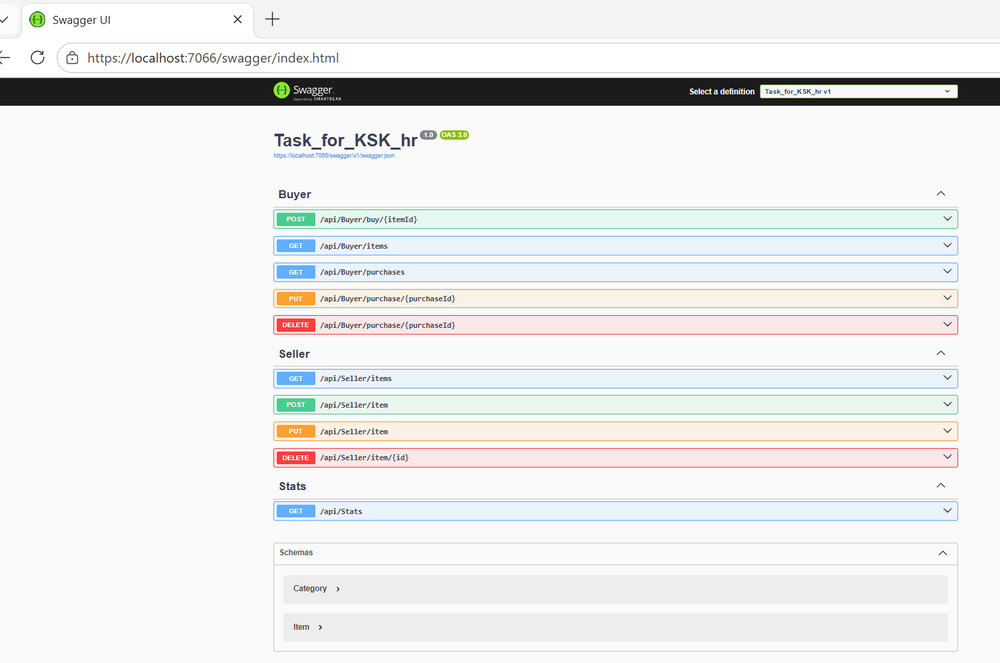
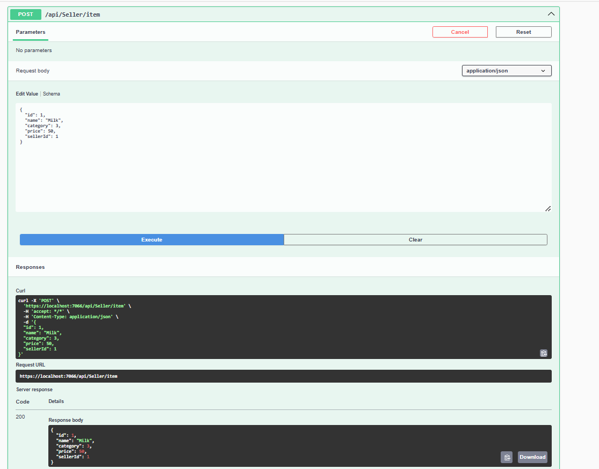
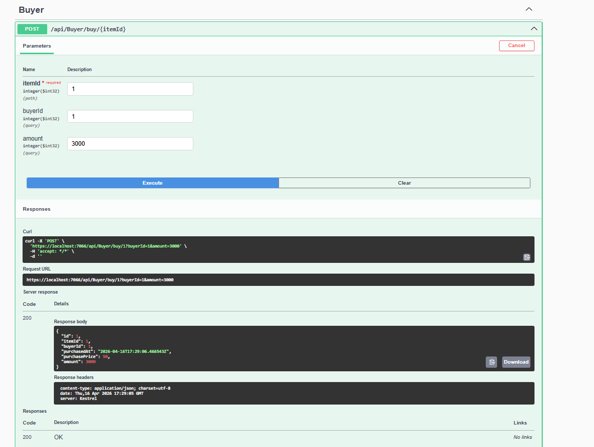
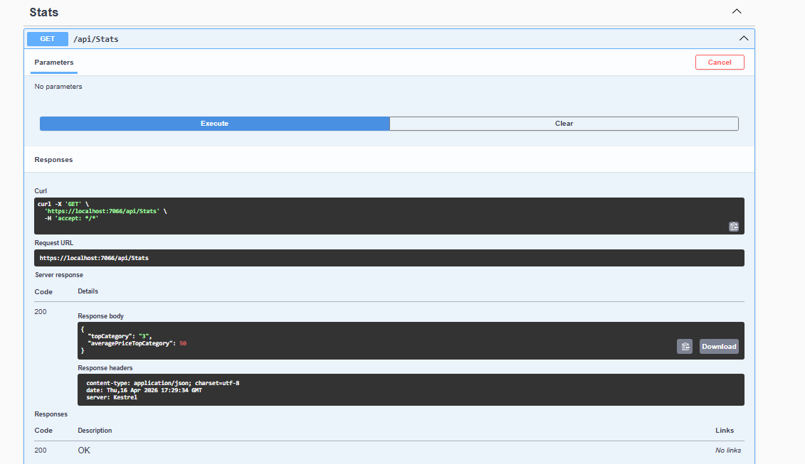
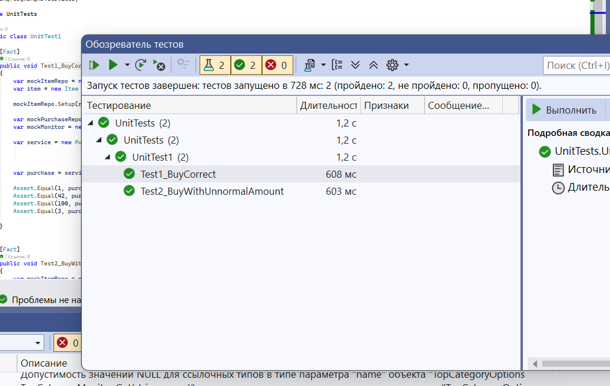

# Веб API для продавца и клиента

API для покупки и продажи товаров. Потокобезопасен.

## Запуск
В браузере перейти на :
`https://localhost:{порт}/swagger` (порт указан в консоли при запуске).

## Скриншоты

### Swagger

### Добавление товара продавцом

### Покупка товара покупателем

### Самый доходный товар

### Тесты

